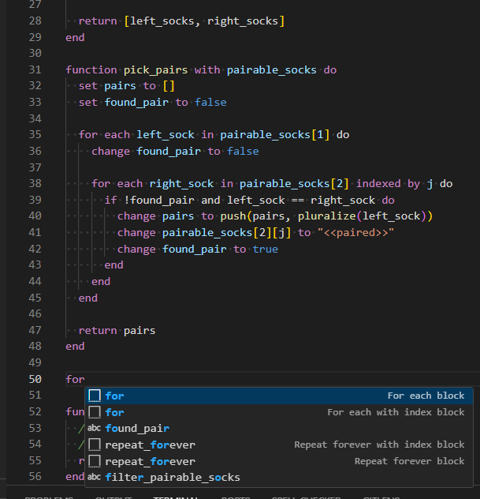

# VSCode JikiScript

Add language support for [Exercism's Bootcamp](https://bootcamp.exercism.org/) language: JikiScript



## Features

- Syntax highlighting as of Level 9 (updated: **2025-03-15**)
- Snippets for common actions
- Language support (`.jiki`, `.jikiscript`, .`jikis` and embedded markdown)

## Known Issues

### Missing colors

If operators such as `>=` or `and` are not highlighted, support for `keyword.operator.*` is missing in your theme.
You can use [custom theming for syntax highlighting](https://code.visualstudio.com/docs/editor/themes#_editor-syntax-highlighting).
See the section **Custom Theming**.

### Strict whitespace

The following code will not highlight properly:

```jikiscript
if(pos["direction"] == "up") do
```

But the following does work:

```jikiscript
if (pos["direction"] == "up") do
```

The highlighter will enforce good use of whitespace, so please make sure you have word boundaries around _all_ keywords.

### Illegal highlighting

As you write your code, highlighting may indicate something is illegal.
This is often because your code _is_ incomplete.

This will show the `function` `with_arguments` as _illegal_, because there is no `end` for the `function` called `test`.
This is caused by the fact that there is no support for nesting function definitions.

```jikiscript
function test do

function with_arguments with argument, another_arg do
```

After the `end` is added, the second `function` is no lo longer illegal.

```jikiscript
function test do
end

function with_arguments with argument, another_arg do
```

## Custom theming

The following can be added to your [`editor.tokenColorCustomizations`](https://code.visualstudio.com/docs/editor/themes#_editor-syntax-highlighting), either directly inside `textMateRules`, or nested underneath your theme(s):

```json
{
  "scope": "support.function.jikiscript",
  "settings": {
    "fontStyle": "underline"
  }
},
{
  "scope": [
    "support.constant.my.jikiscript",
    "punctuation.separator.namespace.jikiscript",
  ],
  "settings": {
    "fontStyle": "bold"
  }
},
```

## Release Notes

See [CHANGELOG.md](./CHANGELOG.md)
