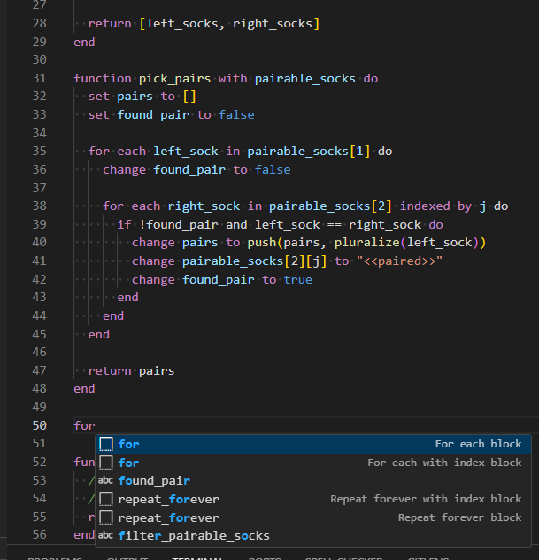

# VSCode JikiScript

Add language support for [Exercism's Bootcamp](https://bootcamp.exercism.org/) language: JikiScript



## Features

- Syntax highlighting as of Level 10 (updated: **2025-03-16**)
- Snippets for common actions
- Language support (`.jiki`, `.jikiscript`, `.jikis` and embedded markdown)

### Strong contextual support

The highlighter can detect illegal use of `break`, `continue`, `next` and `return` in any scope.

```jikiscript
// Illegal
return
break
continue
next
```

```jikiscript
function test do
  // Illegal
  break

  // Fine
  return
end
```

```jikiscript
if true do
  // Illegal
  break
end
```

```jikiscript
repeat_forever do
  // Illegal
  return

  // Fine
  continue
end
```

## Known Issues

### Missing colors

If operators such as `>=` or `and` are not highlighted, support for `keyword.operator.*` is missing in your theme.
You can use [custom theming for syntax highlighting](https://code.visualstudio.com/docs/editor/themes#_editor-syntax-highlighting).
See the section **Custom Theming**.

### Strict whitespace

The following code will not highlight properly:

```jikiscript
if(pos["direction"] == "up") do
```

But the following does work:

```jikiscript
if (pos["direction"] == "up") do
```

The highlighter will enforce good use of whitespace, so please make sure you have word boundaries around _all_ keywords.

### Illegal highlighting

As you write your code, highlighting may indicate something is illegal.
This is often because your code _is_ incomplete.

## Custom theming

The following can be added to your [`editor.tokenColorCustomizations`](https://code.visualstudio.com/docs/editor/themes#_editor-syntax-highlighting), either directly inside `textMateRules`, or nested underneath your theme(s):

```json
{
  "scope": "support.function.jikiscript",
  "settings": {
    "fontStyle": "underline"
  }
},
{
  "scope": [
    "support.constant.my.jikiscript",
    "punctuation.separator.namespace.jikiscript",
  ],
  "settings": {
    "fontStyle": "bold"
  }
},
```

## Release Notes

See [CHANGELOG.md](./CHANGELOG.md)

## Examples

<details>
  <summary>Weather</summary>

```jikiscript
function meteo_data_for with meteo_data, year, month, day do
  return meteo_data["meteorological"][year][month][day]
end

function meteo_description_at with meteo_summary, time do
  for each entry in meteo_summary do
    if entry["time"] == time do
      return entry["description"]
    end
  end
end

function draw_weather with meteo_data do
  set summary to meteo_data_for(meteo_data, "2025", "02", "25")["weather"]["summary"]

  set elements to []
  set counter to 0
  set transform to {}

  for each time in ["06:00", "07:00", "08:00", "09:00"] do
    change elements to description_to_elements(meteo_description_at(summary, time))

    change counter to 0
    for each element in elements do
      change counter to counter + 1
    end

    change transform to transform_at(time)

    draw_sky(transform)

    for each element in elements do
      if element == "sun" do
        draw_sun(transform, counter == 1)
      else if element == "cloud" do
        draw_cloud(transform)
      else if element == "rain" do
        draw_rain(transform)
      else if element == "snow" do
        draw_snow(transform)
      end
    end
  end
end

function transform_at with time do
  set boxes to {
    "06:00": {
      "x": 25,
      "y": 4,
      "s": 50
    },

    "07:00": {
      "x": 1,
      "y": 66,
      "s": 30
    },

    "08:00": {
      "x": 35,
      "y": 66,
      "s": 30
    },

    "09:00": {
      "x": 69,
      "y": 66,
      "s": 30
    }
  }

  return boxes[time]
end

function draw_sky with transform do
  // Draw the sky
  fill_color_hex("#ADD8E6")
  transformed_rectangle(transform, 0, 0, 100, 100)
end

function transformed_circle with transform, center_x, center_y, radius do
  set scale to transform["s"] / 100

  change center_x to center_x * scale + transform["x"]
  change center_y to center_y * scale + transform["y"]
  change radius to radius * scale

  circle(center_x, center_y, radius)
end

function transformed_rectangle with transform, left, top, width, height do
  set scale to transform["s"] / 100

  change left to left * scale + transform["x"]
  change top to top * scale + transform["y"]
  change width to width * scale
  change height to height * scale

  rectangle(left, top, width, height)
end

function transformed_ellipse with transform, center_x, center_y, radius_x, radius_y do
  set scale to transform["s"] / 100

  change center_x to center_x * scale + transform["x"]
  change center_y to center_y * scale + transform["y"]
  change radius_x to radius_x * scale
  change radius_y to radius_y * scale

  ellipse(center_x, center_y, radius_x, radius_y)
end

function draw_sun with transform, sunny_by_itself do
  fill_color_hex("#ffed06")

  if sunny_by_itself do
    transformed_circle(transform, 50, 50, 25)
  else do
    transformed_circle(transform, 75, 30, 15)
  end
end

function draw_cloud with transform do
  fill_color_hex("#ffffff")

  transformed_circle(transform, 40, 40, 15)
  transformed_circle(transform, 25, 50, 10)
  transformed_circle(transform, 75, 50, 10)
  transformed_circle(transform, 55, 40, 20)
  transformed_rectangle(transform, 25, 50, 50, 10)
end

function draw_rain with transform do
  fill_color_hex("#24b2ff")
  transformed_ellipse(transform, 30, 70, 3, 5)
  transformed_ellipse(transform, 50, 70, 3, 5)
  transformed_ellipse(transform, 70, 70, 3, 5)
  transformed_ellipse(transform, 40, 80, 3, 5)
  transformed_ellipse(transform, 60, 80, 3, 5)
end

function draw_snow with transform do
  fill_color_hex("#ffffff")
  transformed_circle(transform, 30, 70, 5)
  transformed_circle(transform, 50, 70, 5)
  transformed_circle(transform, 70, 70, 5)
  transformed_circle(transform, 40, 80, 5)
  transformed_circle(transform, 60, 80, 5)
end

function description_to_elements with description do
  if description == "sunny" do
    return ["sun"]
  else if description == "dull" do
    return ["cloud"]
  else if description == "miserable" do
    return ["cloud", "rain"]
  else if description == "hopeful" do
    return ["sun", "cloud"]
  else if description == "rainbow-territory" do
    return ["sun", "cloud", "rain"]
  else if description == "exciting" do
    return ["cloud", "snow"]
  else if description == "snowboarding-time" do
    return ["sun", "cloud", "snow"]
  else do
    log description
    boom("💥")
  end
end
```

</details>

<details>
  <summary>Wordle</summary>

```jikiscript
class Knowledge do
  private property exacts
  private property exact_skips
  private property presence_minimums
  private property presence_counts

  constructor do
    // The characters known for their respective index / position
    set this.exacts to ["", "", "", "", ""]

    // The characters that are not allowed to be in the respective index/position
    set this.exact_skips to [[], [], [], [], []]

    set this.presence_minimums to {}
    set this.presence_counts to {}
  end

  private method reset_counts with guess do
    for each character in guess do
      change this.presence_minimums[character] to 0
    end
  end

  public method learn_from_guess with guess, result do
    this.reset_counts(guess)

    set absents to []

    for each character in guess indexed by i do
      if result[i] == "correct" do
        this.set_exact(i, character)
      else if result[i] == "present" do
        this.set_present(i, character)
      else if result[i] == "absent" do
        this.set_absent(i, character)
        change absents to push(absents, character)
      end
    end

    // After processing everything, the maximum amount a letter should be present is known if there was at least one absent
    for each character in absents do
      if my#has_key(this.presence_minimums, character) and my#has_key(this.presence_counts, character)  do
        change this.presence_counts[character] to this.presence_minimums[character]
      end
    end

    return this.has_guessed_correctly()
  end

  private method has_guessed_correctly do
    for each character in this.exacts do
      if character == "" do
        return false
      end
    end

    return true
  end

  private method set_exact with index, character do
    change this.exacts[index] to character
    change this.presence_minimums to increment(this.presence_minimums, character)
  end

  private method set_present with index, character do
    change this.exact_skips[index] to my#to_unique(push(this.exact_skips[index], character))
    change this.presence_minimums to increment(this.presence_minimums, character)
  end

  private method set_absent with index, character do
    change this.exact_skips[index] to my#to_unique(push(this.exact_skips[index], character))

    if !my#has_key(this.presence_counts, character) do
      change this.presence_counts[character] to 0
    end
  end

  public method is_valid_guess with guess do
    // Set each character to 0 because then it doesn't need a has key check
    set remaining_counts to {
      "q": 0, "w": 0, "e": 0, "r": 0, "t": 0, "y": 0, "u": 0, "i": 0, "o": 0, "p": 0,
      "a": 0, "s": 0, "d": 0, "f": 0, "g": 0, "h": 0, "j": 0, "k": 0, "l": 0,
      "z": 0, "x": 0, "c": 0, "v": 0, "b": 0, "n": 0, "m": 0
    }

    for each c in this.exacts indexed by i do
      // Ensure all the exact (previously correct) spots are filled
      if c != "" and guess[i] != c do
         return false
      end

      // Any previously present values are not allowed on this exact spot
      if my#contains(this.exact_skips[i], guess[i]) do
        return false
      end

      // Keep track of all the letters seen
      change remaining_counts to increment(remaining_counts, guess[i])
    end

    // If it reaches this point, it knows that all the letters that have
    // a fixed position or excluded position are either in their fixed
    // position ("correct") or missing at their excluded positions.

    // If there was ever at least on "correct" or "present", this checks
    // if there were at least as many as then correct + present.
    for each character, known_minimum_count in this.presence_minimums do
      if known_minimum_count > remaining_counts[character] do
        return false
      end
    end

    // If there was ever an absent for a letter, it knows exactly how
    // many there should be of that letter. Enforces these counts.
    for each character, known_exact_count in this.presence_counts do
      if known_exact_count != remaining_counts[character] do
        return false
      end
    end

    return true
  end
end

function process_game do
  set game to new WordleGame()
  game.draw_board()

  // Always guess the first common word without any knowledge
  set guess to common_words()[1]
  set knowledge to new Knowledge()

  set guess_index to 1
  set guess_colors to []

  repeat 6 times indexed by row do
    change guess_colors to get_colors_for_guess(game.target_word, guess)
    game.add_word(row, guess, guess_colors)

    // Learn from the guess' result colors
    if knowledge.learn_from_guess(guess, guess_colors) do
      return
    end

    for each next_guess in common_words() indexed by next_guess_index do
      // Skip all previous guesses
      if guess_index >= next_guess_index do
        next
      end

      // Find the next valid guess
      if knowledge.is_valid_guess(next_guess) do
        change guess_index to next_guess_index
        change guess to next_guess
        break
      end
    end
  end
end

function process_first_guess with secret_target, guess do
  process_game(secret_target, [guess])
end

function get_colors_for_guess with secret_target, guess do
  set colors to ["", "", "", "", ""]
  set counts to tally(secret_target)

  for each character in guess indexed by i do
    if secret_target[i] == character do
      change counts[character] to counts[character] - 1
      change colors[i] to "correct"
    end
  end

  for each character in guess indexed by i do
    if colors[i] != "" do
      next
    end

    if my#has_key(counts, character) and counts[character] > 0 do
      change counts[character] to counts[character] - 1
      change colors[i] to "present"
    else do
      change colors[i] to "absent"
    end
  end

  return colors
end

function tally with enumerable do
  set counts to {}

  for each item in enumerable do
    if not my#has_key(counts, item) do
      change counts[item] to 0
    end

    change counts[item] to counts[item] + 1
  end

  return counts
end

function increment with hash, key do
  if not my#has_key(hash, key) do
    change hash[key] to 0
  end

  change hash[key] to hash[key] + 1

  return hash
end
```

</details>
